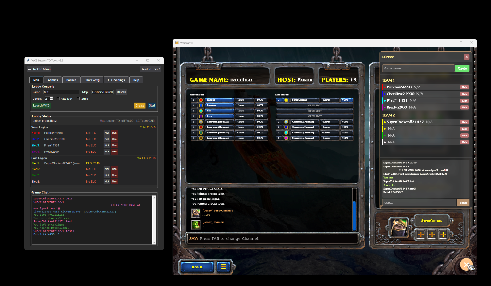

...thanks to [kgallimore](https://github.com/kgallimore)) for his help and work...

Disaclamer: I have zero coding skills, everything is vibecoded.

# LGNbot — WC3 Legion TD Companion Tool

> A Windows desktop application for **Warcraft III Legion TD** hosts — featuring real-time lobby monitoring, ELO tracking, player ranking, and automated game management.

---

## Features

- **Warcraft 3 Proxy** — Intercepts and monitors in-game chat and lobby events in real time via a local WebSocket proxy
- **ELO & Ranking System** — Tracks player performance across games at [www.LGNw3.com](https://www.lgnw3.com)
- **Player Management** — Admin/ban list support, auto-kick for banned players, and customizable welcome messages
- **Game Results Logger** — Automatically records game outcomes to `games.json` for history and stats
- **License & Expiry System** — Hardware-fingerprint–based activation with server-side expiry validation and version-aware state management
- **Plugin Architecture** — Modular design; features are loaded as plugins from the main launcher (`main.py`)
- **System Tray Support** — Runs minimized to tray with single-instance enforcement

---



## Project Structure

```
├── test.py            # Main launcher & plugin host (GUI entry point)
├── LEGIONTD.py        # Warcraft 3 proxy plugin — chat monitoring, ELO, bans
├── Ranking.py         # Game results sender & ranking plugin
├── install.py         # Installation / setup script
└── Files/             # Runtime data (auto-created)
    ├── games.json
    ├── wc3_elos.txt
    ├── wc3_bans.txt
    ├── wc3_admins.txt
    └── ...
```

---

## Requirements

- Windows 10/11
- Python 3.10+
- Warcraft III with a running game instance

### Dependencies

```bash
pip install requests websockets watchdog pillow pystray psutil pywin32 winshell matplotlib
```

---

## Getting Started

1. Clone the repository:
   ```bash
   git clone https://github.com/your-username/lgnbot.git
   cd lgnbot
   ```

2. Install dependencies:
   ```bash
   pip install -r requirements.txt
   ```

3. Run the application:
   ```bash
   python test.py
   ```

4. From the launcher, select a plugin (e.g. **LEGIONTD.py**) and connect to your game lobby.

---

## License

This project is absolutely not a licensed software. It was made out of curiosity, with absolutely zero coding skills.

---

*Made with ❤️ by SuperChicken — [www.LGNw3.com](https://www.lgnw3.com)*
